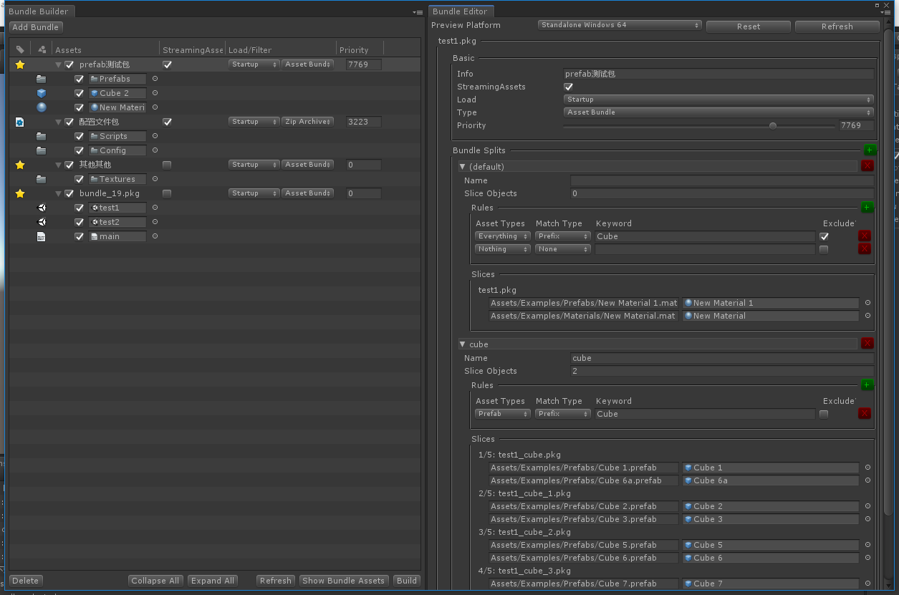

# unityfs

提供一个轻量实用的资源和文件访问层, 简化资源热更新项目的开发流程. 
开发过程中可以使用编辑器模式直接访问工程内的任意资源, 并在发布时无缝切换到通过 AssetBundle 访问资源.
配置文件与脚本代码独立压缩打包, 运行期直接读取压缩包访问文件, 且不受 Unity 文件命名限制.

# 目标特性
* 异步加载资源/场景
* 自动管理资源加载/卸载
* 自动管理资源更新
* 按优先级下载资源
* 支持断点续传
* 支持多下载源重试
* 支持边玩边下
* 可视化打包管理
* 打包文件夹时按资源类型过滤
* 按分包容量自动分包

# 进度
功能基本完成. <br/>

# 实例

## 初始化
```csharp

UnityFS.ResourceManager.Initialize();
```

## 打开资源管理器, 有两种管理器可以使用
```csharp


// 方式1. 在编辑器中可以脱离 AssetBundle 直接资源加载
    #if UNITY_EDITOR
    if (developMode)
    {
        // 打开编辑器专用资源加载器
        UnityFS.ResourceManager.Open(new UnityFS.AssetDatabaseAssetProvider());
    }
    #endif

// 方式2. 通过资源包进行资源加载
    var dataPath = string.IsNullOrEmpty(Application.temporaryCachePath) ? Application.persistentDataPath : Application.temporaryCachePath;
    var localPathRoot = Path.Combine(dataPath, "packages");

    // 可用下载地址列表 (会依次重试, 次数超过地址数量时反复重试最后一个地址)
    // 适用于 CDN 部署还没有全部起作用时, 退化到直接文件服务器地址
    var urls = UnityFS.Utils.Helpers.URLs(
        // "http://localhost:8081/",
        "http://localhost:8080/"
    );
    //  获取到资源清单
    var manifest = ...; 
    // 打开资源包资源加载器
    UnityFS.ResourceManager.Open(new UnityFS.BundleAssetProvider(manifest, localPathRoot, urls, 1));
```

## 资源加载
UnityFS.ResourceManager 返回的资源会自动管理加载卸载与资源包依赖: <br/>
* IFileSystem
* UAsset

当资源实例不存在强引用时将进入GC流程, 对应资源包将被自动卸载.

### 加载文件 (脚本/配置等)
IFileSystem 中的文件可以同步加载. 
```csharp
// 获取核心脚本代码包
var fs = UnityFS.ResourceManager.FindFileSystem("Assets/Examples/Scripts/code.js");
fs.completed += self =>
{
    // 可以在这里由脚本接管后续启动流程
    // 需要保持对 fs 的引用, 无引用时将在GC后自动释放对应包
    ScriptEngine.Initialize(fs); 
    ScriptEngine.RunScript("Assets/Examples/Scripts/code.js");

    // 判断文件是否存在
    var exists = fs.Exists("Assets/Examples/not_exist.file");
    Debug.Log($"file exists? {exists}");

    // 读取文件内容 (zip包中的文件可以同步读取)
    var data = fs.ReadAllBytes("Assets/Examples/Config/test.txt");
    Debug.Log(System.Text.Encoding.UTF8.GetString(data));
};
```

### 加载资源 (异步)

```csharp
// 方式1. 得到原始 UAsset 对象
UnityFS.ResourceManager.LoadAsset("Assets/Examples/Prefabs/Cube 1.prefab", self =>
{
    UnityFS.Utils.AssetHandle.CreateInstance(self, 5.0f);
});

// 方式2. 通过辅助方法直接创建 GameObject (返回的是一个代理 GameObject)
UnityFS.ResourceManager.Instantiate("Assets/Examples/Prefabs/Cube 1.prefab").DestroyAfter(10.0f);
```

### 加载场景 (异步)
```csharp
// LoadScene/LoadSceneAdditive 分别对应 Single/Additive 场景加载模式
var scene = UnityFS.ResourceManager.LoadSceneAdditive("Assets/Examples/Scenes/test2.unity");
scene.completed += self =>
{
    Debug.Log("scene loaded");
};

StartCoroutine(UnityFS.Utils.Helpers.InvokeAfter(() =>
    {
        // 场景对象需要手工卸载 (异步完成)
        // 场景对应的资源包则在所有场景实例对象GC后自动卸载
        scene.UnloadScene(); 
        scene = null;
    }, 20f)
);
```

# 打包编辑器


# License
MIT
